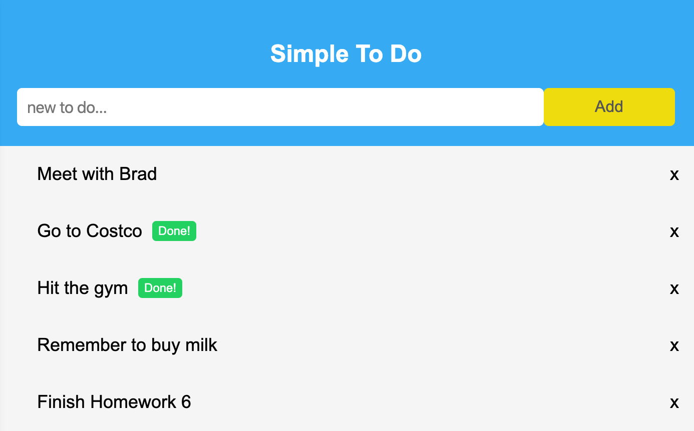

# React Simple Todo List

_(built with React 16.10 in 2019 for SSUI)_

Live at: [https://react-todo-ssui.netlify.com/](https://react-todo-ssui.netlify.com/)

## Preview

This project was bootstrapped with [Create React App](https://github.com/facebook/create-react-app).
